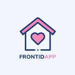
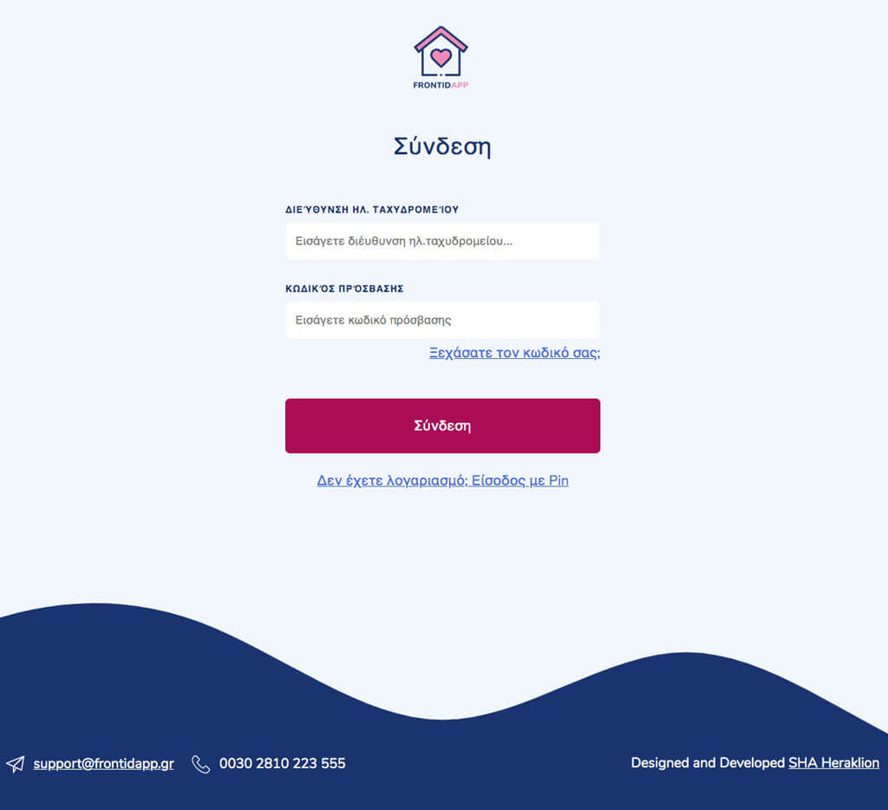
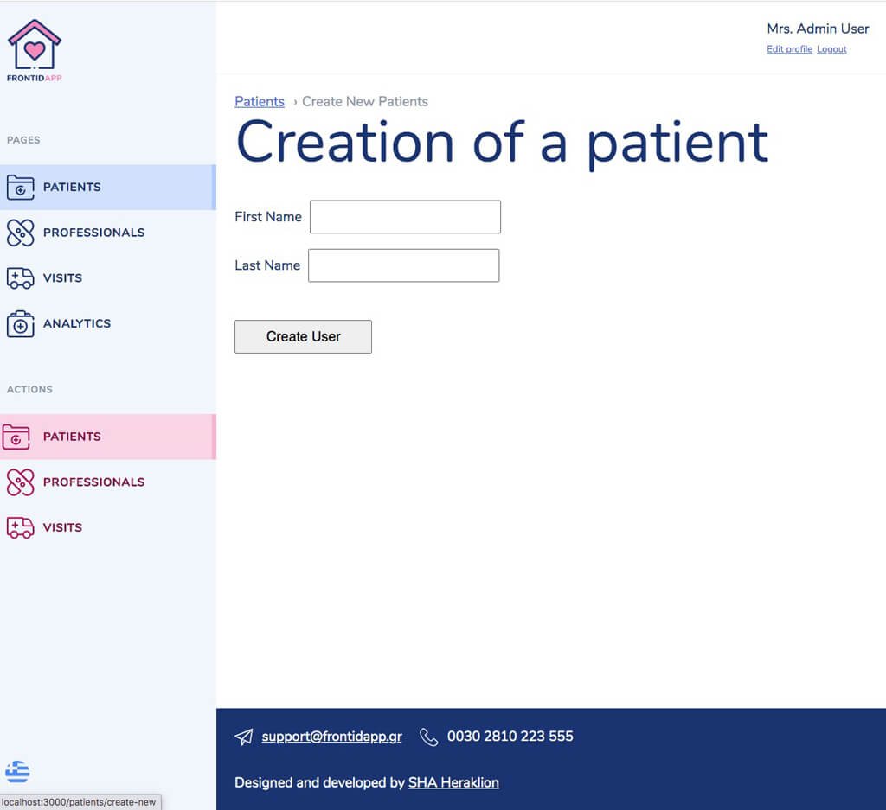
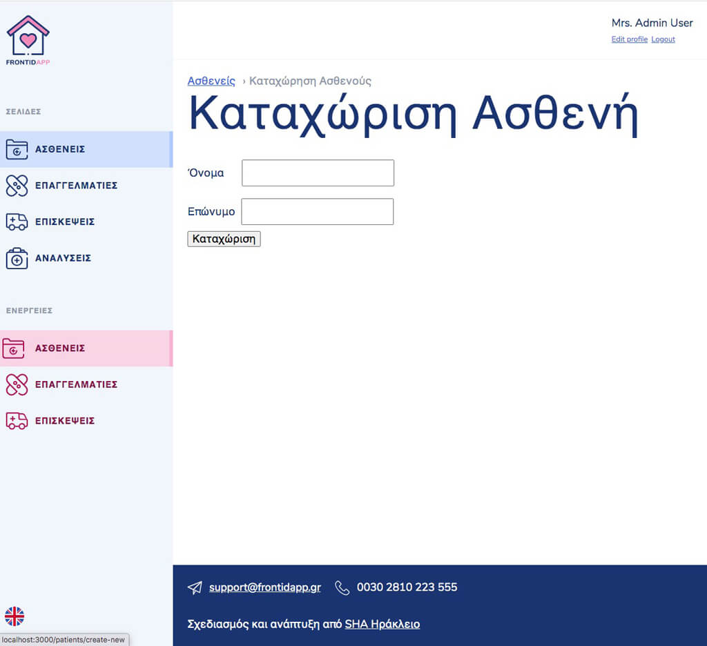
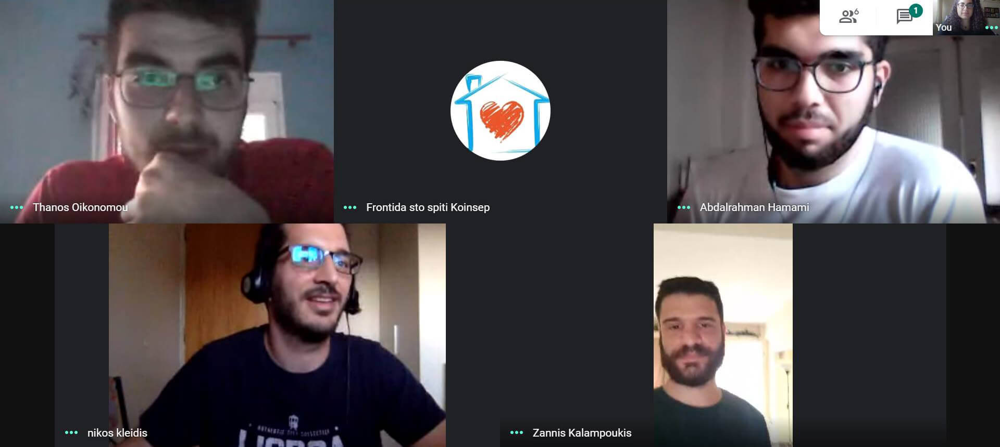

<p align="center">
  
  
  
</p>

# **FrontidApp** | A Social Hackers Academy Students Project

This code repository contains the (Frontend) part of the project **FrodidApp** which was the result of the collaboration between the students of **Social Hackers Academy** Crete Class and the organization [Frontida sto Spiti](https://frontidastospiti.com/).

Financial support by [U.S. Embassy Athens](https://gr.usembassy.gov/) as part of the [**De-Code Integration**](https://web.facebook.com/socialhackersacademy/photos/a.243864032803820/651702105353342/) Project.

## Description

The goal of the Application is to offer effective on-site medical services to vulnerable groups and it's available in Greek and English language.

**Screenshots:**

___Application Login Page___



___Create a Patient Panel___



___Create a Patient Panel (Greek)___



## Technical Specifications

The project was created using the following web technologies:

- HTML
- CSS 
- JavaScript & React.JS
- Node.JS & Express.JS
- Swagger
- MySQL (Database)
- Git and GitHub for Version Control
- Heroku (Backend Hosting)

The Backend code can be found in this [GitHub repository](https://github.com/SocialHackerCreteClass/FrodidApp-BackEnd).

The PDF containing the application functionality can be found [here](./Frontida_sto_Spiti_Application_English.pdf)

## People

- Project Managers / Contributors / Mentors
    - Abdalrahman Hamami (Head of Education at SHA)
    - Aggelina Mila (Managing Director at SHA)
    - Thanos Oikonomou
    - Nikos Kleidis
    - Zannis Kalampoukis

- Students of Class Crete
    - [Giorgios Makrakis](https://www.linkedin.com/in/giorgos-makrakis/)
    - Jenny Kariotaki
    - Manos Ktistakis
    - Mike Tsimplostefanakis
    - [Nikos Spiropoulos](https://www.linkedin.com/in/nikos-spiropoulos-813167181/)
    - Konstantinos Antoniadis
    - [Maria Skalidaki](https://www.linkedin.com/in/maria-skalidaki/)
    - Daniel Kapeleti
    - [Stylianos Anastasakis](https://www.linkedin.com/in/stelios-anastasakis/)
    - Dimitris Kolotouros
    - Manos Krasanakis
    - [Salvador Cabello](https://www.linkedin.com/in/juan-salvador-cabello-56130248/)
    - Midyan Hamdoun

Made with :heart: by SHA Crete.



---

## Installation Process

Before you run this project you need to set up [**Prettier**](https://marketplace.visualstudio.com/items?itemName=esbenp.prettier-vscode) and [**eslint**](https://marketplace.visualstudio.com/items?itemName=dbaeumer.vscode-eslint).

Prettier should be run on every save of a file.

---

## Launching the Project

In order to run this project you should run:

```bash
npm run start
```

or in case you are using `yarn` as your Node package manager:

```bash
yarn start
```

Open [http://localhost:3000](http://localhost:3000) to view it in the browser.

This project was bootstrapped with [Create React App](https://github.com/facebook/create-react-app).

The page will reload if you make edits.

You will also see any lint errors in the console.

Other commands:

- `npm run test` or  `yarn test` to launch the test runner in interactive watch mode

- `npm run build` or `yarn build` to build the app for production. This will create a `build` folder which you can deploy for production.

- `npm run eject` or `yarn eject`. Be careful with this command. More on this command [here](https://create-react-app.dev/docs/available-scripts/#npm-run-eject)